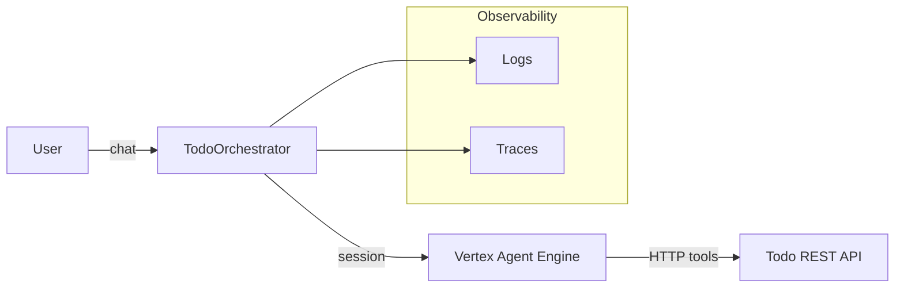

# Template Agent

A production-minded Vertex AI Gemini agent that orchestrates the Todo REST API from [`template-go`](https://github.com/spacetj/template-go/pull/1/files). The agent uses the Vertex AI Agent Development Kit (ADK) pattern, exposes the Todo CRUD tools, and can run locally or be deployed to Vertex AI Agent Engine.

## Architecture


## Quickstart
1. Discover all helper commands (including ADK UI helpers):
   ```bash
   make help
   ```
2. Create a virtual environment and install dependencies:
   ```bash
   make install
   ```
3. Copy `.env.sample` to `.env` and fill in values (use Secret Manager for production secrets).
4. Run the agent locally with streaming conversation:
   ```bash
   make run-local
   ```
5. Launch the ADK developer UI (requires `gcloud alpha` plus `VERTEX_PROJECT_ID` and `VERTEX_LOCATION`):
   ```bash
   make adk-ui
   ```

## Deployment
Use the placeholder script to outline deployment to Vertex Agent Engine:
```bash
bash scripts/deploy_agent_engine.sh
```

## Testing & Quality
- Lint: `make lint`
- Format: `make format`
- Unit + integration tests: `make test` (runs fast local + CI suite)
- End-to-end evals: `pytest -m e2e` (exercises orchestration against a mocked Todo API)
- Deployed agent evals: set `DEPLOYED_AGENT_URL` (and optional `DEPLOYED_AGENT_TOKEN`) to run `pytest -m deployed` against a live Agent Engine endpoint.
- Security scans: `make security` (runs the same `pip-audit` + `bandit` checks as CI)

## CI/CD
GitHub Actions cover linting, testing, and security scanning so changes stay verifiable in pull requests:

- `Lint`: runs Ruff, Black (check), and mypy on pushes and pull requests.
- `Test`: executes the pytest suite with the same configuration as `make test`.
- `Security Scan`: runs dependency (`pip-audit`) and static analysis (`bandit`) scans on pushes, PRs, and a weekly schedule.

## Security & Operations
See `docs/SECURITY.md` for IAM, VPC-SC, CMEK guidance and content filters. Operational practices and failure modes are captured in `docs/OPERATIONS_RUNBOOK.md`.
