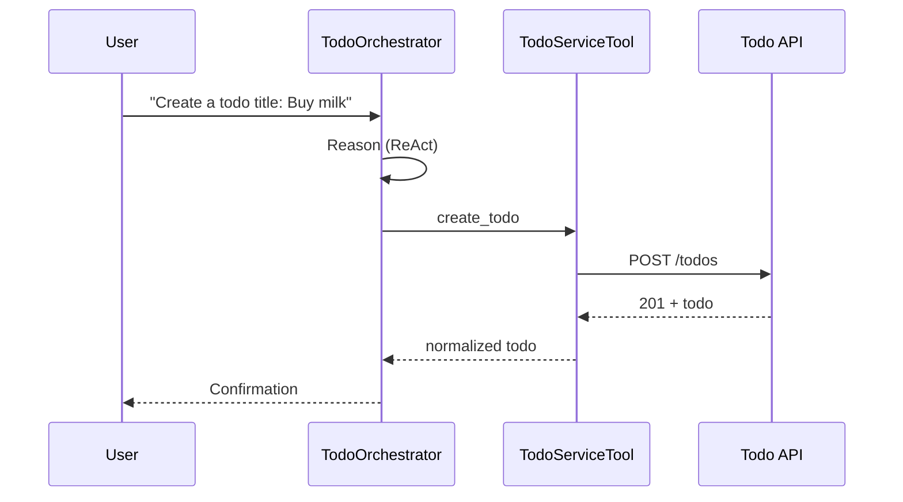

# Agent Overview

## Components
- **TodoOrchestrator**: Gemini-powered ADK agent exposing list/create/update/delete capabilities.
- **TodoServiceTool**: HTTP client wrapper around the Todo REST service with validation, caching, retries, and rate limiting.
- **Observability**: Structured logs and OpenTelemetry spans around every tool call and agent step.

## Sequence: Create Todo

Similar flows exist for update and delete, with retries on transient failures and safety checks on inputs.

## Reasoning Pattern
The agent follows a ReAct loop: interpret intent, validate safety, call the tool, verify success, and summarize. Ambiguities trigger clarifying questions before tool execution. Sessions are multi-turn, allowing users to manage a backlog over time.

## Memory and Sessions
Vertex AI Session API maintains context across turns. Keep prompts concise and rely on tool results to ground responses. Configure `MAX_CONTEXT_TOKENS` to bound context growth.
